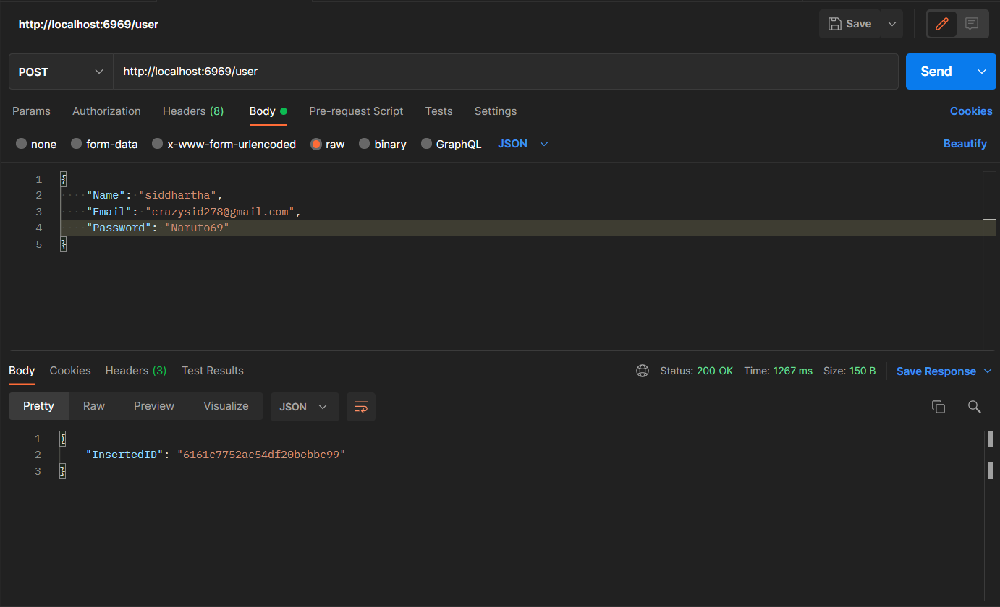
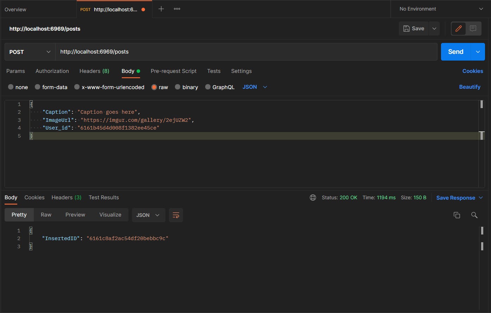
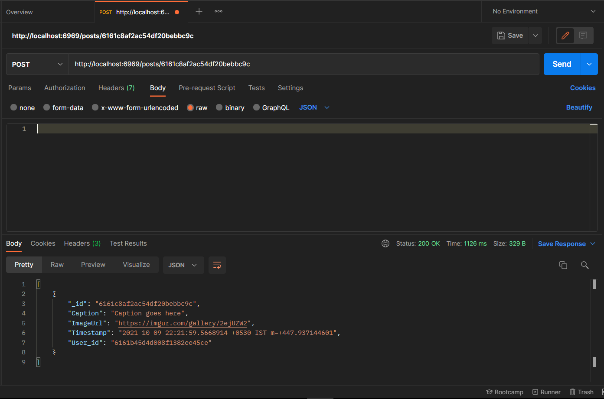
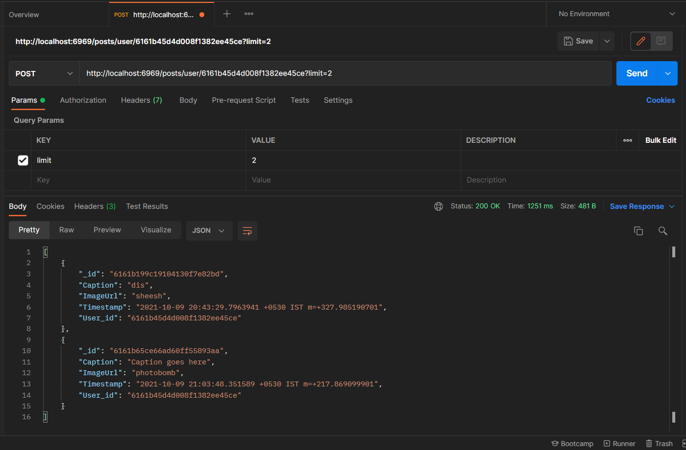
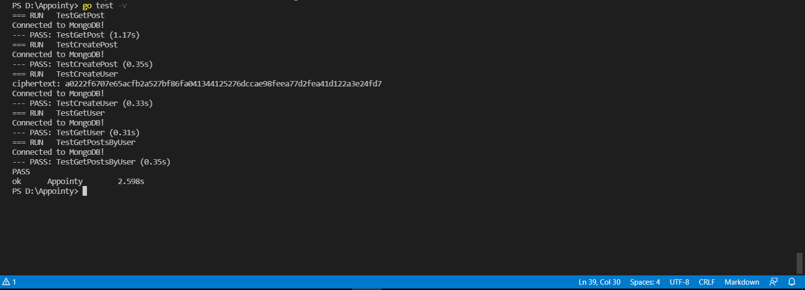

# Instagram-backend
# Instagram Backend API

### An API for Intagram backend capable of adding and retrieving users and posts.

## Features:

1. Generated Endpoints:
    Get User
    Create User
    Create Post
    Get Post
    List User Posts
2. Password Encrypted to avoid reverse engineering:
    Encryption using Cypher and dynamically generated key
3. Server is thread safe
4. Pagination added to list endpoint:
    Limit parameter set to limit the number of posts retrieved
5. Unit Testing done using go lang testing:
    Passed all 5 unit test parameters

### POST request to /users

Create a user object using name, email and password fields.
Password field is hashed and sent to mongo backend.

### GET request to /users/id

Get any user object using the user's ID

### POST request to /posts

Create a post object using caption, image URL and userID.
A server side timestamp is generated for the post.

### GET request to /posts/id

Get any post using the post ID.

### GET request to /posts/users/id?limit

Get all posts of any user using the user's ID.

### Unit Testing

Unit Testing results for all 5 api requests

